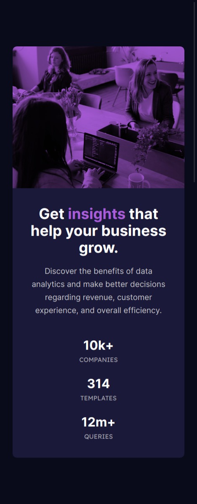

# Frontend Mentor - Stats preview card component solution

This is a solution to the [Stats preview card component challenge on Frontend Mentor](https://www.frontendmentor.io/challenges/stats-preview-card-component-8JqbgoU62). Frontend Mentor challenges help you improve your coding skills by building realistic projects. 

## Table of contents

- [Frontend Mentor - Stats preview card component solution](#frontend-mentor---stats-preview-card-component-solution)
  - [Table of contents](#table-of-contents)
  - [Overview](#overview)
    - [The challenge](#the-challenge)
    - [Screenshot](#screenshot)
    - [Links](#links)
    - [Built with](#built-with)
    - [What I learned](#what-i-learned)
    - [Continued development](#continued-development)
  - [Author](#author)

## Overview

### The challenge

Users should be able to:

- View the optimal layout depending on their device's screen size

### Screenshot

- Desktop Version

-Mobile Version 

### Links

- Live Site URL: [ live site URL](https://stats-preview-24g72xh1c-hadysane.vercel.app/)

### Built with

- Semantic HTML5 markup
- CSS custom properties
- Flexbox
- Mobile-first workflow

### What I learned

I learn how color the image with backgound-color and background image and 
the property  "background-blend-mode"

### Continued development

I continued the challenge Frontend montor of easy project to hard project.

## Author

- Frontend Mentor - [@hadysane](https://www.frontendmentor.io/profile/hadysane)
- Twitter - [@HadySane](https://twitter.com/HadySane)

